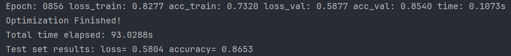

### 用于GNN代码的复现

* GCN代码复现完毕,改进对原始数据集的处理,数据集的随机划分,以及实现模型的保存,但是模型准确率降低,怀疑是数据处理影响模型效果:

处理前:

处理后:

经过测试,是数据集的关系:
随机划分的问题：在代码中，训练集、验证集和测试集是通过随机掩码生成的。这种随机划分可能没有考虑到图中节点间的连通性，导致训练集可能无法代表整个图的特性。这种划分可能导致训练数据不足或者不具代表性，从而影响模型的泛化能力。

考虑子图连通性之后;

### 用于GAT代码复现

* GAT代码浮现完毕，改进对原始数据集的处理,数据集的随机划分
* 代码准确率 最高可达 0.864+

